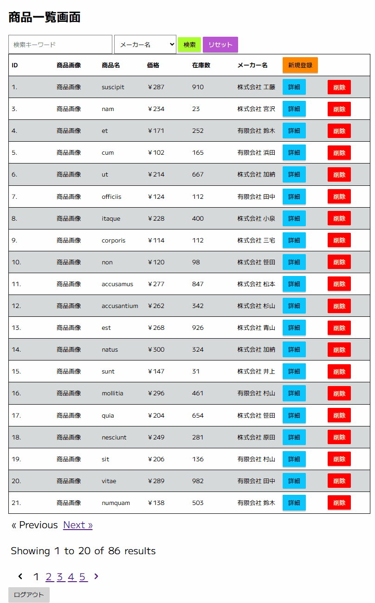

# 旧 CyTech Engineer Step7 「商品管理システム」

## 🚀概要
本システムは自動販売機の売り上げ管理、商品管理を目的としたウェブアプリケーションです。
主な機能は以下の通りです。
* 認証機能(新規登録, ログイン)
* 商品の一覧表示機能(検索機能含む)
* 商品の詳細情報閲覧機能
* 商品情報の登録機能
* 商品情報の編集機能
* 商品情報の削除機能

## ▶️動作イメージ

## ✨こだわり機能・技術
#### 全画面共通
* 未ログインの状態でプロジェクトにアクセスした場合、「ログイン」画面へリダイレクト
* テンプレート(ベースレイアウト)の継承
* **ページ遷移時に「商品情報一覧」画面で入力した検索条件を維持**
* ボタンをホバーした際に押し込んだようなアニメーションを実装
* 「ログアウト」ボタンの追加

#### 商品情報一覧画面
* 「(検索条件)リセット」ボタンの追加
* 「削除」ボタン押下時に確認ダイアログを表示
* **「メーカー名」セレクトボックスで表示するリストを、現在の検索条件にヒットするメーカーのみに限定**
* ホバー中の商品の色を変更

#### 商品新規登録画面
* サブビューのインクルード

#### 商品情報編集画面
* サブビューのインクルード

#### バリデーション
* **Form Request の利用**

#### データベース
* **Factory->$faker によるテストデータの生成**
* **DatabaseSeeder によるデータの一括投入**
* **リレーション(一対一, 一対多)の厳守(必ず紐づいています!!!!!)**

## 📦使用技術

## 🛠️開発環境
| 名称 | バージョン |
| :--- | :--- |
| Microsoft Windows | 10.0.26200.8457 |
| Windows Terminal | 1.24.11321.0 |
| Git | 2.52.0.windows.1 |
| PHP | 8.2.12 |
| Laravel Framework | 12.54.1 |
| mariaDB | 10.4.32 |
| Node.js | 24.14.0 |
| Visual Studio Code | 1.121.0 |
| Gemini | - |

## ⚙️ 設定 (Configuration)
#### 環境変数
.envに必要な設定値(.env.exampleに設定済み)
| 環境変数 | 説明 | 値 |
| :--- | :--- | :--- |
| `API_KEY` | 静的トークン | `php artisan key:generate`で生成してください |
| `APP_LOCALE` | システム言語 | ja |
| `APP_FAKER_LOCALE` | Fakerが生成するデータの言語 | ja_JP |
| `DB_CONNECTION` | 使用するデータベースの種類 | mariadb |
| `DB_HOST` | データベースサーバの場所 | 127.0.0.1 |
| `DB_PORT` | データベースのポート番号 | 3306 |
| `DB_DATABASE` | データベースの名前 | tng_cte_s7and8 |
| `DB_USERNAME` | データベースにログインする際のユーザ名 | root |
| `DB_PASSWORD` | データベースにログインする際のパスワード | セキュリティ上ここでの記載は避けます |

#### 初期ユーザ
シーダーを実行すると自動で作成されます。もちろん、ご自由に新規登録いただいて構いません。

| ユーザ名 | メールアドレス | 説明 |
| :--- | :--- | :--- |
| user | user@example.com | 開発用に作成したもの |
| Test User | test@example.com | Laravelのデフォルト |

## 📖使い方
1. プロジェクトを配置したいディレクトリへ移動
1. リポジトリのクローン
    * git clone git@github.com:sakiyatakumi000531/tng-cte-s7and8.git
1. プロジェクトのフォルダへ移動
    * cd ./tng-cte-s7and8/
1. 外部パッケージのインストール
    * composer install
1. 外部パッケージのインストール
    * npm install
1. .envの作成(OSによってコピーのコマンドが異なるので、いずれかを実行)
    * copy .env.example .env(Win)
    * cp .env.example .env(Mac, Linux)
1. APP_KEYの自動生成
    * php artisan key:generate
1. Laravel内部のキャッシュのクリア(念のため。不要説濃厚)
    * php artisan config:clear
1. マイグレーション & シーダー の実行(データベース & テストデータの生成)
    * php artisan migrate --seed
1. TypeScript、Sass、Vue.js、React などのファイルのオンデマンド・コンパイル(「ブラウザで開いている画面」に必要なファイルだけをその場で翻訳)
    * npm run dev
1. Laravelの開発用サーバの起動
    * php artisan serve
1. ブラウザで http://127.0.0.1:8000/ にアクセス

## ⚠️注意点
* 新規登録時と編集時にファイルを選択させていますが、配布された設計書のDB定義シートのProductsテーブルの"img_path"のデータ型が"varchar"だったので、実際には登録できない仕様になっています。

## 👤作者(Author)
初心者エンジニア
